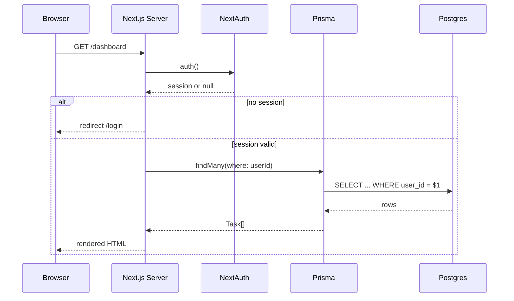
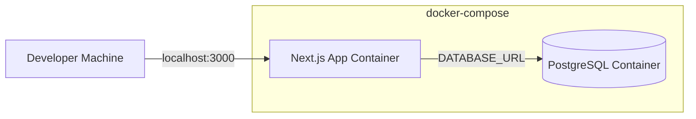

# System Architecture Document
## Project: TaskSaaS (CodeMind v0 Demo Application)
### Version 1.0.0

---

## 1. Purpose

This document ties together the Frontend, Backend, and Database PRDs into a single coherent system view: how the CodeMind single agent uses the Project Manifest as its source of truth to generate a consistent, working application.

---

## 2. System Context

```mermaid
graph TD
    U[User] -->|"Build a task management SaaS..."| AP[Architecture Planner]
    AP -->|Generates| PM[Project Manifest JSON]
    PM -->|Reviewed & Approved by User| PM
    PM --> DG[Database Generator]
    PM --> BG[Backend Generator]
    PM --> FG[Frontend Generator]
    DG --> IE[Integration Engine]
    BG --> IE
    FG --> IE
    IE -->|Verified| REPO[GitHub Repository]
    REPO -->|Clone + docker-compose up| APP[Running App on localhost:3000]
```

---

## 3. Component Responsibilities

| Component | Reads | Writes | Never Does |
|---|---|---|---|
| Architecture Planner | User's natural-language request | `project_manifest.json` | Does not write application code |
| Database Generator | `manifest.database` | `prisma/schema.prisma`, migrations, seed | Does not invent tables not in the manifest |
| Backend Generator | `manifest.api`, `manifest.database`, `manifest.auth` | API route handlers | Does not modify the DB schema or invent endpoints |
| Frontend Generator | `manifest.frontend`, `manifest.api` | Pages, components | Does not call endpoints absent from `manifest.api` |
| Integration Engine | All generator outputs | Shared types, README, `.env.example`, verification report | Does not silently proceed past a failed check |

This strict read/write boundary is the entire point of the manifest pattern: **every generator's output must trace back to a manifest entry.** If a generator needs something not in the manifest, that's a signal the Architecture Planner's output was incomplete — not a license for the generator to improvise.

---

## 4. Request Lifecycle (Runtime, Post-Generation)

---

## 5. Deployment Topology (v0 — Local Only)

- **Single command:** `docker-compose up`
- **Two containers:** the Next.js app and PostgreSQL. No load balancer, no reverse proxy, no CDN — all explicitly deferred (cloud deployment is Phase 1+ per the roadmap).
- **Environment variables** (`.env.example`, generated by the Integration Engine):
  - `DATABASE_URL`
  - `NEXTAUTH_SECRET`
  - `NEXTAUTH_URL`
  - `GOOGLE_CLIENT_ID`
  - `GOOGLE_CLIENT_SECRET`

---

## 6. Cross-Cutting Consistency Rules

These are the rules that prevent the three generators from drifting apart — the most important part of this whole document:

1. **Shared types are derived, not duplicated.** `types/task.ts` is generated once by the Integration Engine from `manifest.shared_types`, and both frontend and backend import from it. No generator hand-writes its own copy of the `Task` type.
2. **Validation logic lives once.** The Zod schema is defined in `lib/validation.ts` and imported by both the API route handlers (server validation) and `TaskForm` (client validation via the Zod resolver).
3. **Ownership scoping is enforced only at the query layer**, consistently, in every single query that touches `Task` — never assumed, never skipped, per the Backend PRD's template pattern.
4. **Every route in `manifest.api` must have a corresponding fetch call in the frontend, and vice versa** — the Integration Engine's cross-check step (Week 6) fails the build if these are mismatched.

---

## 7. Verification Gate Summary (Full Pipeline)

| Stage | Owner | Check |
|---|---|---|
| 1 | Database Generator | `prisma validate`, `prisma generate`, `prisma migrate dev`, `prisma db seed` |
| 2 | Backend Generator | `tsc --noEmit`, manual auth/ownership smoke tests |
| 3 | Frontend Generator | `tsc --noEmit`, manual route-protection + CRUD smoke tests |
| 4 | Integration Engine | `npm install`, `prisma generate`, `prisma migrate deploy`, `npm run build`, `npm run test` |
| 5 | Final gate | Fresh clone → `docker-compose up` → full manual user journey (sign in, create, edit, delete, refresh-persists) |

**Rule:** a failure at any stage halts the pipeline and reports which stage failed with logs — it does not silently continue to the next stage.

---

## 8. Explicitly Out of Scope (System-Wide, v0)

Per the CodeMind roadmap's Phase 0 anti-patterns list — restated here for the architecture layer specifically:

- No multi-agent coordination (one agent, sequential generation)
- No multi-model routing (one model)
- No graph database (the JSON manifest is the only "brain" v0 needs)
- No cloud deployment (local Docker only)
- No brownfield/existing-repo ingestion (greenfield generation only)

These boundaries are what make a 6-week solo build achievable. Revisit only after this vertical slice's exit criteria (85% build success rate, <$5/generation, <15 min wall-clock) are actually met.
