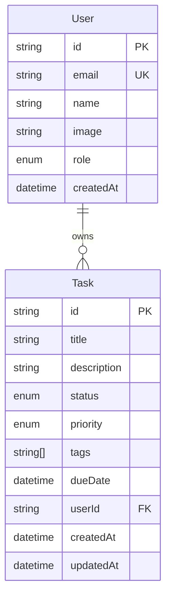

# Database PRD & Technical Design
## Project: TaskSaaS (CodeMind v0 Demo Application)
### Version 1.0.0

---

## 1. Executive Summary

TaskSaaS requires a relational database layer supporting multi-user task management with authentication, ownership isolation, and CRUD operations. This document specifies the complete database design: schema, relationships, constraints, indexing, migration strategy, and security model for the v0 demo scope.

**Scope boundary:** This is a single-tenant-per-user, single-instance PostgreSQL deployment for local/demo use. Multi-region replication, sharding, and enterprise backup/DR strategy are explicitly out of scope for v0 (deferred to Phase 2+ per the CodeMind roadmap).

---

## 2. Technology Stack

| Layer | Technology | Version | Rationale |
|---|---|---|---|
| Database | PostgreSQL | 16.x | ACID compliance, native JSON, mature ecosystem, Prisma-first support |
| ORM | Prisma | 5.x | Type-safe client generation, declarative schema, built-in migration tooling |
| Connection pooling | Prisma's built-in pool (dev) | — | Sufficient for local/demo; PgBouncer deferred to production phase |
| Local runtime | Docker (postgres:16-alpine) | — | Reproducible, zero local install requirement |

---

## 3. Conceptual Data Model

Two core entities for v0: **User** and **Task**, in a one-to-many relationship (one user owns many tasks). This is intentionally minimal — the schema must fully support the manifest's demo scenario and nothing more.



---

## 4. Logical Schema (Prisma)

```prisma
// prisma/schema.prisma

generator client {
  provider = "prisma-client-js"
}

datasource db {
  provider = "postgresql"
  url      = env("DATABASE_URL")
}

enum Role {
  USER
  ADMIN
}

enum TaskStatus {
  TODO
  IN_PROGRESS
  DONE
}

enum TaskPriority {
  LOW
  MEDIUM
  HIGH
}

model User {
  id        String   @id @default(cuid())
  email     String   @unique
  name      String?
  image     String?
  role      Role     @default(USER)
  createdAt DateTime @default(now())

  tasks     Task[]

  // NextAuth required relations
  accounts  Account[]
  sessions  Session[]

  @@index([email])
}

model Task {
  id          String       @id @default(cuid())
  title       String
  description String?
  status      TaskStatus   @default(TODO)
  priority    TaskPriority @default(MEDIUM)
  tags        String[]     @default([])
  dueDate     DateTime?
  userId      String
  user        User         @relation(fields: [userId], references: [id], onDelete: Cascade)
  createdAt   DateTime     @default(now())
  updatedAt   DateTime     @updatedAt

  @@index([userId])
  @@index([userId, status])
  @@index([dueDate])
}

// --- NextAuth.js required models (Prisma adapter) ---

model Account {
  id                String  @id @default(cuid())
  userId            String
  type              String
  provider          String
  providerAccountId String
  refresh_token     String? @db.Text
  access_token      String? @db.Text
  expires_at        Int?
  token_type        String?
  scope             String?
  id_token          String? @db.Text
  session_state     String?

  user User @relation(fields: [userId], references: [id], onDelete: Cascade)

  @@unique([provider, providerAccountId])
}

model Session {
  id           String   @id @default(cuid())
  sessionToken String   @unique
  userId       String
  expires      DateTime
  user         User     @relation(fields: [userId], references: [id], onDelete: Cascade)
}

model VerificationToken {
  identifier String
  token      String   @unique
  expires    DateTime

  @@unique([identifier, token])
}
```

**Design notes:**
- `Account`, `Session`, `VerificationToken` are the standard NextAuth.js Prisma adapter models — required verbatim for OAuth session management, not optional.
- `onDelete: Cascade` on `Task.user` and NextAuth relations ensures deleting a user cleans up dependent rows — appropriate for a demo app with no soft-delete/audit requirement yet.
- `tags` uses Postgres native array type (`String[]`) rather than a join table — appropriate at this scale; revisit if tags need independent metadata (color, ownership) later.

---

## 5. Constraints & Validation Rules

| Rule | Enforcement Layer |
|---|---|
| `User.email` must be unique | DB constraint (`@unique`) |
| `Task.title` required, non-empty | DB (`NOT NULL`) + Zod validation at API layer |
| `Task.userId` must reference existing `User` | DB foreign key |
| `Task.status` restricted to enum values | DB enum type |
| A user may only read/write their own tasks | **Not a DB constraint** — enforced at API query layer (all task queries scoped by `WHERE userId = session.user.id`) |

**Important:** Row-level security (Postgres RLS) is not used in v0. Ownership isolation is enforced in application code (every Prisma query filters by `userId` from the authenticated session). This is a deliberate simplification — RLS is a Phase 2+ hardening step once the single-agent pipeline is proven.

---

## 6. Indexing Strategy

| Index | Purpose |
|---|---|
| `User.email` | Login lookup (NextAuth queries by email during OAuth callback) |
| `Task.userId` | Every dashboard query filters by owner — this is the hottest query path |
| `Task(userId, status)` composite | Supports the dashboard's status filter without a table scan |
| `Task.dueDate` | Supports future "upcoming tasks" sort/filter |

No further indexing is justified at demo scale (single-digit users, low task volume). Query optimization for scale is explicitly deferred.

---

## 7. Migration Strategy

- **Tool:** Prisma Migrate (`prisma migrate dev` for local development, `prisma migrate deploy` for the integration engine's automated run)
- **Initial migration:** `prisma/migrations/0001_init/` generated directly from the schema above
- **Seed data:** `prisma/seed.ts` inserts one demo user and 4-5 sample tasks across different statuses/priorities, so the dashboard is non-empty on first run
- **Rollback:** Not implemented for v0 — a failed migration in the demo simply means re-running `docker-compose down -v && docker-compose up` to reset state. Production-grade rollback tooling is a Phase 1+ concern.

---

## 8. Verification Checklist (Database Layer)

| Check | Command | Pass Criteria |
|---|---|---|
| Schema validity | `npx prisma validate` | Exits 0 |
| Client generation | `npx prisma generate` | Exits 0, produces `node_modules/.prisma/client` |
| Migration apply | `npx prisma migrate dev --name init` | Exits 0, tables created |
| Seed | `npx prisma db seed` | Exits 0, rows visible via `prisma studio` |
| Type safety | `tsc --noEmit` | No errors referencing Prisma types |

---

## 9. Explicitly Out of Scope for v0

- Read replicas / horizontal scaling
- Multi-region deployment
- Table partitioning
- Automated backup/disaster recovery
- Postgres Row-Level Security policies
- Audit/change-history tables
- Soft deletes

These are real, valid concerns — they belong in the Phase 2+ enterprise hardening track (per the CodeMind 36-month roadmap), not the 6-week vertical slice.
